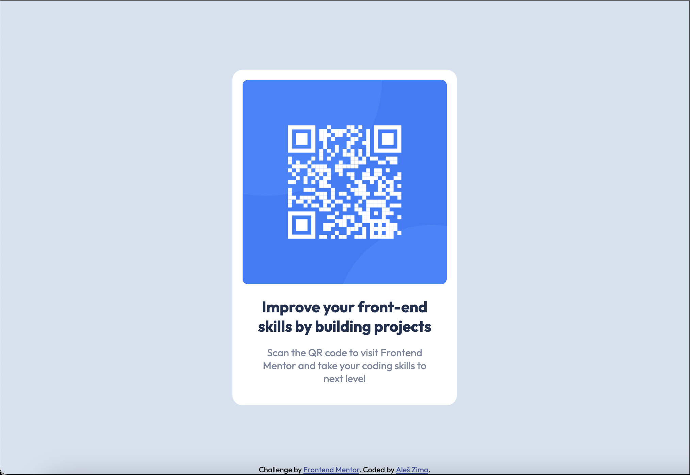

# Frontend Mentor - QR code component solution

This is a solution to the [QR code component challenge on Frontend Mentor](https://www.frontendmentor.io/challenges/qr-code-component-iux_sIO_H).

## Table of contents

- [Overview](#overview)
  - [Screenshot](#screenshot)
  - [Links](#links)
- [My process](#my-process)
  - [Built with](#built-with)
  - [What I learned](#what-i-learned)
- [Author](#author)

## Overview

### Screenshot

'

### Links

- Solution URL: [https://github.com/Esosek/challenge-qr-code](https://github.com/Esosek/challenge-qr-code)
- Live Site URL: [https://esosek.github.io/challenge-qr-code](https://esosek.github.io/challenge-qr-code)

## My process

### Built with

- Semantic HTML5 markup
- CSS variables
- Flexbox
- Mobile-first workflow

### What I learned

I learned how to center elements vertically using Flexbox and how to use custom CSS variables for colors.

## Author

- Frontend Mentor - [@Esosek](https://www.frontendmentor.io/profile/Esosek)
